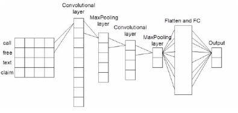

# SpamClassifier
CNN used for spam classification

# Goal
Answer the question how well CNN works for NLP classification task like: spam classification or sentiment anlysis

# Description
This project is based on paper "Convolutional Neural Network based SMS Spam Detection" by Milivoje Popovac, Mirjana Karanovic, Srdjan Sladojevic, Marko Arsenovic, Andras Anderla. Firstly I will build model with proposed architecture:

Then I will try with diffrent architecture.

# Model classification examples
## Note
This particualar model was trained on expanded dataset (added something like 5 or 6 more spam examples to dataset, cause I think 
that tiago's dataset lacks most frequently appearing spam messages)

If prediction is higher than 0.5 it is classified as a spam message.

0.99975175
   -------    
   |SPAM!| -> Press this button to win 500 dollars
   -------    
0.0005950826
   -------    
   | HAM!| -> I will be late today. Do not wait for me honey
   -------    
1.0
   -------    
   |SPAM!| -> REMINDER FROM O2: To get 2.50 pounds free call credit and details of great offers plsreply 2 this text with your valid name, house no and postcode
   -------    
0.9997117
   -------    
   |SPAM!| -> To earn 1000 dollars send your valid name
   -------    
0.940359
   -------    
   |SPAM!| -> If you want to win a car send your vaild email
   -------  
